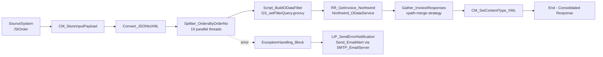

# SI_Order_SplitGather_Sync

A SAP Integration Suite (Cloud Integration) iFlow demonstrating the **Split-Gather** Enterprise Integration Pattern in a **synchronous** scenario - built to mirror a real production constraint encountered while integrating SAP S/4HANA.

---

## 1. Production Background

In a live S/4HANA implementation, a source system triggered a **synchronous GET** call to retrieve invoice data (~200 invoices) from S/4HANA via CPI.

The call consistently failed **before it ever reached S/4HANA** - it was terminated at the **HTTP gateway layer** because the response payload exceeded the gateway's size limit (~8,195 bytes).

**Resolution implemented in production:**
- Split the 200 invoices into chunks of 50
- Process each chunk as a separate call
- Aggregate (gather) all chunk responses
- Return a single consolidated response to the source system - synchronously

This repo recreates that **Split-Gather** pattern end-to-end using a public OData service, since the original S/4HANA endpoint and gateway constraint aren't available outside the client landscape.

---

## 2. Demo Adaptation

| Production | This Demo |
|---|---|
| S/4HANA Invoice GET (OData) | Northwind OData V4 - `Invoices` entity |
| ~200 invoices, chunked into batches of 50 | Each order number is split into its own message and processed individually (parallelized) |
| HTTP gateway size limit (~8KB) triggered the split | Split-Gather pattern demonstrated structurally (the public demo service has no such limit) |
| Consolidated response returned synchronously | Same - consolidated XML returned synchronously to the caller |

The **pattern and CPI configuration are production-equivalent**; only the data source and the original failure trigger differ.

---

## 3. Architecture



---

## 4. iFlow Steps

| # | Step | Type | Purpose |
|---|---|---|---|
| 1 | `CM_StoreInputPayload` | Enricher | Captures the raw inbound JSON into property `inputPayload` (used for error notification) |
| 2 | `Convert_JSONtoXML` | JsonToXmlConverter | Converts inbound JSON to XML for splitting |
| 3 | `Splitter_OrdersByOrderNo` | Splitter (XPath) | Splits `/OrderRequest/orders/` into individual messages. 10 parallel threads, streaming enabled, stop-on-error |
| 4 | `Script_BuildODataFilter` (`GS_setFilterQuery.groovy`) | Script | Reads `orderNo` from each split message, builds OData query `$filter=OrderID eq <orderNo>` and stores it as property `filterQuery` |
| 5 | `RR_GetInvoice_Northwind` | ExternalCall (OData V4) | Calls `Northwind_ODataService` - `Invoices` entity with `$select=...` + the dynamic `$filter` |
| 6 | `Gather_InvoiceResponses` | Aggregator | Merges all individual `<Invoice>` responses back into a single `<Invoices>` payload using `xpath-merge-strategy` |
| 7 | `CM_SetContentType_XML` | Enricher | Sets `Content-Type: application/xml` on the consolidated response |
| 8 | End | - | Returns the consolidated response synchronously to `SourceSystem` |

### Exception Handling
If any step fails, the **`ExceptionHandling_Block`** subprocess catches the error and calls **`LIP_SendErrorNotification`** - a local integration process that runs **`Send_EmailAlert`** via `SMTP_EmailServer`, sending the original request payload (`inputPayload`) along with a generic error message - so the relevant team is notified without exposing internal error details to the caller.

---

## 5. Sender Configuration

- **Adapter:** HTTPS
- **Endpoint:** `/SIOrder`
- **Authentication:** Role-based (`ESBMessaging.send`)

---

## 6. Sample Request

`POST` to `/SIOrder`

```json
{
  "OrderRequest": {
    "orders": [
      { "orderNo": "10248" },
      { "orderNo": "10249" },
      { "orderNo": "10250" }
    ]
  }
}
```

> For load/volume testing (simulating the ~200 record production scenario), the `orders` array can be extended to 200 entries - each is split and processed independently with up to 10 running in parallel.

---

## 7. Sample Response (illustrative)

```xml
<?xml version="1.0" encoding="UTF-8"?>
<Invoices>
  <Invoice>
    <CustomerName>Vins et alcools Chevalier</CustomerName>
    <Salesperson>Steven Buchanan</Salesperson>
    <OrderID>10248</OrderID>
    <ShipperName>Federal Shipping</ShipperName>
    <ProductID>11</ProductID>
    <ProductName>Queso Cabrales</ProductName>
    <UnitPrice>14.00</UnitPrice>
    <Quantity>12</Quantity>
    <Discount>0</Discount>
    <ShipName>Vins et alcools Chevalier</ShipName>
    <ShipAddress>59 rue de l'Abbaye</ShipAddress>
    <ShipCity>Reims</ShipCity>
    <ShipCountry>France</ShipCountry>
    <OrderDate>1996-07-04T00:00:00Z</OrderDate>
    <Freight>32.38</Freight>
  </Invoice>
  <Invoice>
    <CustomerName>Toms Spezialitäten</CustomerName>
    <OrderID>10249</OrderID>
    <!-- ... remaining fields ... -->
  </Invoice>
  <Invoice>
    <CustomerName>Hanari Carnes</CustomerName>
    <OrderID>10250</OrderID>
    <!-- ... remaining fields ... -->
  </Invoice>
</Invoices>
```

> Replace this with an actual captured response from your test run for the final GitHub version - it's more credible than a constructed example.

---

## 8. Design Considerations

- **Parallel processing (10 threads):** Each `orderNo` results in its own OData call. For larger volumes, sequential calls would be too slow, so the General Splitter is configured for parallel execution.
- **Streaming + Stop-on-Execution:** Streaming keeps memory usage low for larger payloads; stop-on-execution ensures a single failed split halts processing and routes to the exception subprocess rather than returning a partial/inconsistent response.
- **Gather with `xpath-merge-strategy`:** Ensures all individual `<Invoice>` elements are merged under a single `<Invoices>` root, regardless of arrival order.
- **Synchronous response:** Matches the production requirement - the calling system needs the consolidated result in the same call, not via callback/async notification.

---

## 9. Tech Stack

- SAP Integration Suite - Cloud Integration (CPI)
- OData V4 Adapter (Northwind public service)
- Groovy scripting
- JSON ↔ XML conversion
- General Splitter / Gather (Split-Gather EIP)
- SMTP-based exception notification

---

## 10. Repository Structure

```
SI_Order_SplitGather_Sync/
├── README.md
├── docs/
│   ├── sample-request.json
│   └── sample-response.xml
└── iflow/                     # Exportable CPI integration project
    ├── META-INF/
    ├── metainfo.prop
    └── src/main/resources/
        ├── scenarioflows/integrationflow/SI_Order_SplitGather_Sync.iflw
        ├── script/GS_setFilterQuery.groovy
        ├── edmx/...
        └── wsdl/InvoicesEntityGET.xsd
```
